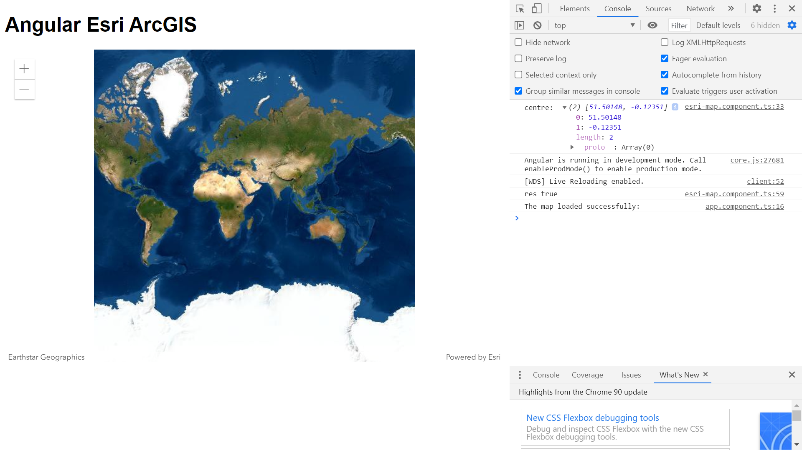

# :zap: Angular Esri Arcgis

- Angular app to display a zoomable map view using the ArcGIS API mapping solution from [Esri](https://www.esri.com/en-us/home) with [esri-loader](https://github.com/Esri/esri-loader). **Note:** This is the old-fashioned way using esri-loader - from v4.18 of the ArcGIS API for JavaScript it is easier to use @arcgis/core and [building with Esri ES modules](https://developers.arcgis.com/javascript/latest/es-modules/) instead of using esri-loader.

## :page_facing_up: Table of contents

- [:zap: Angular Esri Arcgis](#zap-angular-esri-arcgis)
  - [:page_facing_up: Table of contents](#page_facing_up-table-of-contents)
  - [:books: General info](#books-general-info)
  - [:camera: Screenshots](#camera-screenshots)
  - [:signal_strength: Technologies](#signal_strength-technologies)
  - [:floppy_disk: Setup](#floppy_disk-setup)
  - [:flashlight: Testing](#flashlight-testing)
  - [:computer: Code Examples](#computer-code-examples)
  - [:cool: Features](#cool-features)
  - [:clipboard: Status \& To-Do List](#clipboard-status--to-do-list)
  - [:clap: Inspiration](#clap-inspiration)
  - [:file_folder: License](#file_folder-license)
  - [:envelope: Contact](#envelope-contact)

## :books: General info

- [ArcGIS API for Javascript CDN](https://developers.arcgis.com/javascript/latest/guide/get-api/#cdn) link in `esri-map` component.
- [ArcGIS for Developers](https://developers.arcgis.com/) offers a full suite of tools and resources to build mapping and analytics solutions. Use ArcGIS APIs to create location-based applications for web, desktop, and mobile devices.

## :camera: Screenshots



## :signal_strength: Technologies

- [Angular v16](https://angular.io/)
- [Esri-loader v3](https://github.com/Esri/esri-loader) library to use the ArcGIS API for JavaScript
- [ArcGIS API for JavaScript v4.27](https://developers.arcgis.com/javascript/) mapping and analytics software
- [@types/arcgis-js-api v4.27.0](https://www.npmjs.com/package/@types/arcgis-js-api) type definitions for ArcGIS API for JavaScript

## :floppy_disk: Setup

- Install dependencies by running `npm i`
- Run `ng serve` for a dev server. Navigate to `http://localhost:4200/`.
- The app will automatically reload if you change any of the source files

## :flashlight: Testing

- No test code added.

## :computer: Code Examples

- extract from `esri-map.component.ts` to set up map coordinates etc.

```typescript
export class EsriMapComponent implements OnInit {
  private _zoom = 10;
  private _center = [0.1246, 51.5007];
  private _basemap = "streets";

  @Input()
  set zoom(zoom: number) {
    this._zoom = zoom;
  }

  get zoom(): number {
    return this._zoom;
  }

  @Input()
  set center(center: any[]) {
    console.log("centre: ", center);
    this._center = center;
  }

  get center(): any[] {
    return this._center;
  }

  @Input()
  set basemap(basemap: string) {
    this._basemap = basemap;
  }

  get basemap(): string {
    return this._basemap;
  }

  @Output() mapLoaded = new EventEmitter<boolean>();
  @ViewChild("mapView", { static: true }) public mapViewEl: ElementRef;

  constructor(private esriMapService: EsriMapService) {}

  public ngOnInit() {
    this.esriMapService.loadMap(this._basemap, this._center, this._zoom, this.mapViewEl).then((res: Boolean) => {
      console.log("result of map loading: ", res);
      this.mapLoaded.emit(true);
    });
  }
}
```

## :cool: Features

- map view pan function

## :clipboard: Status & To-Do List

- Status: Working.
- To-Do: Nothing. This is the old way of accessing map data using esri-loader. In future use [Esri ES modules](https://developers.arcgis.com/javascript/latest/es-modules/).

## :clap: Inspiration

- [ArcGIS API for JavaScript: Building Apps with Angular](https://www.youtube.com/watch?v=ea4D-qGU0_0)
- [esri-loader documentation](https://www.npmjs.com/package/esri-loader)

## :file_folder: License

- This project is licensed under the terms of the MIT license.
